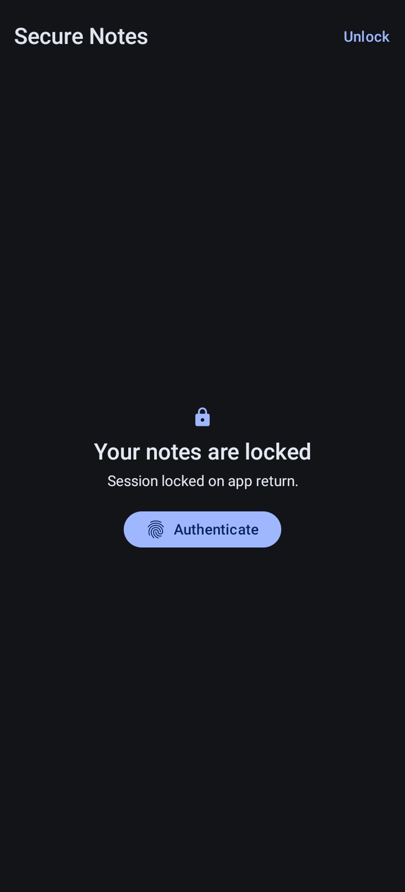
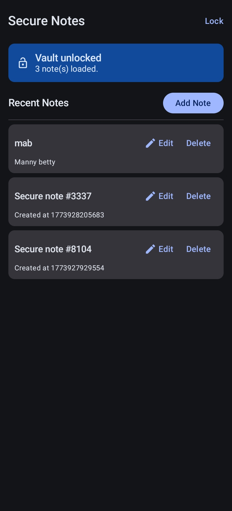

# Secure Notes
**Secure Notes** is a small biometric-locked Android notes app built with Kotlin, Compose, Room, and Android Keystore. 
It demonstrates practical mobile security patterns: biometric/device-credential auth, encrypted-at-rest local storage, and relock-on-return behavior. 

 
 

### [Download](https://github.com/maleeqB/biometricPrompt/raw/main/app/release/secure_notes.apk)
